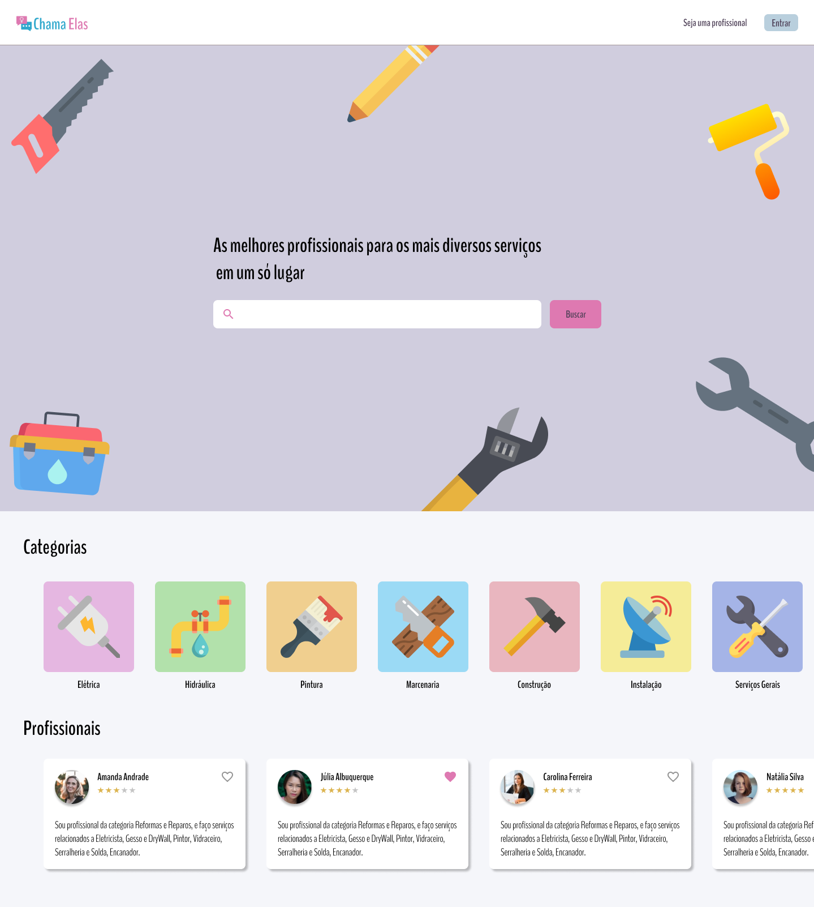

<h1 align="center"></h1>

<div align="center">

    

   [Backend](#Backend) | [Frontend](#Frontend)

</div>

<p align="center">
    
</p>

## Prerequisites

- yarn
- node

## Backend

The project's backend was developed in NodeJS.

### Steps to run

1. Go to the *backend* folder
2. Install dependencies:
    ```
    yarn
    ```
3. Run project: 
    ```
    yarn dev:server
    ```

## Frontend

The project's frontend was developed in ReactJS.

### Steps to run

1. Go to the *frontend* folder
2. Install dependencies:
    ```
    yarn
    ```
3. Run application: 
    ```
    yarn start
    ```

## Author

* **Tatiana Lopes** - [@tatianalopes](https://github.com/tatianalopes)

## License

This project is licensed under the MIT License - see the [LICENSE.md](LICENSE.md) file for details

<div align="center">
  <sub>This project was creted using my
  <a href="https://github.com/tatianalopes/web-project-template">Web project template</a>
</div>